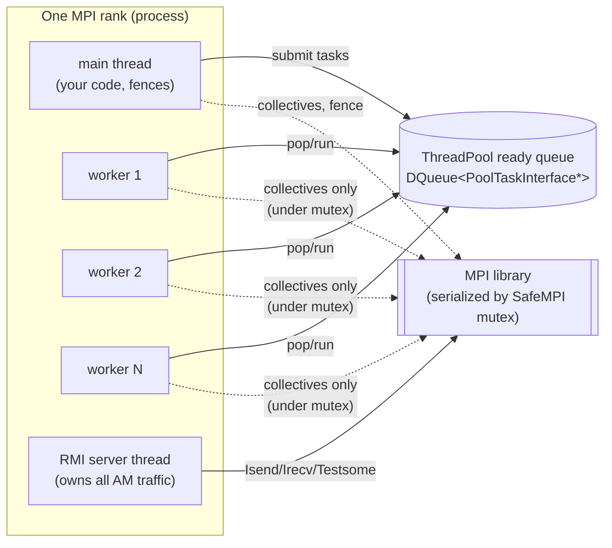

# Chapter 1 — Communication layer: MPI & SafeMPI

[← Index](README.md) · [Next: Active Messages →](02-active-messages.md)

This chapter covers the bottom of the stack: how MADNESS talks to MPI, the
process/thread model, the global MPI mutex, and the tag plan. Everything above
(active messages, tasks, collectives) ultimately turns into the primitives
described here.

Files: `safempi.h`/`.cc`, `worldmpi.h`/`.cc`, `world.h`/`.cc`.

---

## 1.1 The process and thread model

One MPI rank = one OS process. Inside a process MADNESS runs **three kinds of
threads**:



- **Main thread** — runs your program, calls `World::fence()`, submits tasks.
- **Worker threads** — `MAD_NUM_THREADS − 1` of them (`thread.cc:325-346`); they
  pull tasks from the pool and execute them. They do *not* drive point-to-point
  communication.
- **RMI server thread** — exactly one; it owns all active-message send/receive
  (Chapter 3). It is created when `RMI::begin()` runs during `World` startup.

> Thread counting subtlety (`thread.cc:294-298`): with `P > 1` and the TBB
> backend there are `nthreads + 2` OS threads (workers + main + communicator);
> with `P == 1`, `nthreads + 1`. `MAD_NUM_THREADS` is the *total application*
> thread count, so the pool size is one less.

---

## 1.2 SafeMPI: a thread-safe MPI wrapper

MADNESS initializes MPI at the `MPI_THREAD_SERIALIZED` level — MPI may be called
from multiple threads, **but never concurrently**. SafeMPI enforces this by
guarding every MPI call with one global mutex via the `SAFE_MPI_GLOBAL_MUTEX`
macro (`safempi.h:96-99`), which locks `SafeMPI::charon`.

```cpp
// safempi.h:96-99  (conceptually)
#define SAFE_MPI_GLOBAL_MUTEX \
    madness::ScopedMutex<madness::SCALABLE_MUTEX_TYPE> obolus(SafeMPI::charon)
```

**Consequences you must keep in mind when modeling or optimizing:**

1. **There is no intra-process MPI parallelism.** Two threads cannot be inside MPI
   at once. Bandwidth out of a rank is fundamentally single-threaded.
2. **Overlap, not concurrency, is the performance story.** Compute on worker
   threads overlaps with the RMI thread doing communication — but the RMI thread
   itself serializes the wire.
3. **Collectives block a worker or the main thread** while they run (they take the
   mutex), so a `gop.sum` inside a task stalls that thread.

`WorldMpiInterface` (`worldmpi.h`) is a thin per-`World` facade over the rank's
`SafeMPI::Intracomm`, exposing `rank()`, `size()`, `Isend`, `Irecv`, `Bcast`,
`Reduce`, `binary_tree_info`, and unique-tag allocation.

### Primitives actually used

| Call | Wrapper | Used by |
|------|---------|---------|
| `MPI_Isend` | `Intracomm::Isend` (`safempi.h:731`) | RMI send, GOP |
| `MPI_Issend` | `Intracomm::Issend` (`safempi.h:739`) | RMI synchronous-send throttle |
| `MPI_Irecv` | `Intracomm::Irecv` (`safempi.h:747`) | RMI posted receives, GOP |
| `MPI_Ssend` | `Intracomm::Send` (`safempi.h:755`) | huge-message acks |
| `MPI_Test{,some,any}` | `Request::Test*` (`safempi.h:296-431`) | RMI polling, `World::await` |
| `MPI_Bcast/Reduce/Allreduce` | `safempi.h:782-798` | rarely; GOP uses its own tree |

Note that **GOP does not use `MPI_Bcast`/`MPI_Reduce` for its main collectives** —
it builds its own binary tree out of `Isend`/`Irecv` so it can interleave with the
task pool and termination detection (Chapter 5).

---

## 1.3 The tag plan

All RMI point-to-point traffic shares a single tag and uses `MPI_ANY_SOURCE`
receives; ordering and dispatch are handled above MPI. Other tag ranges are
carved out for one-shot needs (`safempi.h:107-113, 533-564`):

| Tag range | Purpose | Allocator |
|-----------|---------|-----------|
| 1 – 999 | one-shot reserved tags | `unique_reserved_tag()` (`safempi.h:556`) |
| 1000 | default send/recv | `DEFAULT_SEND_RECV_TAG` |
| 1001 | archive / parallel I/O | `MPIAR_TAG` |
| **1023** | **all RMI active messages** | `RMI_TAG` |
| 1024 – 4095 | round-robin general tags | `unique_tag()` (period 3072, `safempi.h:533`) |
| 4096 – 8191 | huge-message rendezvous | `RmiTask::unique_tag()` (`worldrmi.cc:488`) |
| 8192 – `MPI_TAG_UB` | unmanaged | — |

The `unique_tag` counters are intentionally **not** mutex-protected: ordering
requirements across processes mean the same sequence of tag requests happens on
every rank, so there is never contention (`safempi.h:534-536`).

---

## 1.4 The `World` object

`World` (`world.h:119-608`) is constructed from a `SafeMPI::Intracomm`
(`world.cc:81-105`) and owns, in initialization order:

```cpp
WorldMpiInterface&  mpi;    // world.h:204  — MPI facade
WorldAmInterface&   am;     // world.h:205  — active messages   (Ch.2)
WorldTaskQueue&     taskq;  // world.h:206  — dataflow tasks     (Ch.4)
WorldGopInterface&  gop;    // world.h:207  — collectives        (Ch.5)
```

Each `World` has a universe-unique `unsigned long _id` (`world.h:187`) assigned on
rank 0 and broadcast (`world.cc:91-97`). A registry maps `(world_id, object_id)`
to C++ object pointers (`map_id_to_ptr`, `world.h:182`); this is how an incoming
active message that names an object id is dispatched to the right
`WorldObject`-derived instance (a container, a function impl) on the receiver.

### Subworlds

A subworld is created by splitting the communicator
(`SafeMPI::Intracomm::Split`/`Create`, `safempi.h:616-654`); each split produces a
new `World` with its own `mpi/am/taskq/gop`. This is the mechanism behind:

- **MacroTaskQ** subworld worker pools, and
- molresponse_v2 `state_parallel "on"` mode, where groups of ranks each form a
  subworld that solves a subset of states.

Ranks are translated between a subworld communicator and `COMM_WORLD` via
`map_to_comm_world` (`worldam.h:252`), computed once with
`MPI_Group_translate_ranks`.

---

## 1.5 What to take to the next chapters

- All point-to-point traffic becomes **active messages** on tag 1023, sent and
  received by a single RMI thread → Chapters 2 and 3.
- MPI is **mutex-serialized**; the only true communication concurrency is the RMI
  thread overlapping with compute.
- A `World` = communicator + four services; **subworlds** partition ranks for
  state-parallel work.

[← Index](README.md) · [Next: Active Messages →](02-active-messages.md)
