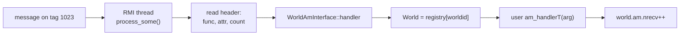

# Chapter 2 — Active Messages (WorldAM)

[← Communication layer](01-communication-layer.md) · [Index](README.md) · [Next: RMI thread →](03-rmi-thread.md)

An **active message (AM)** is a one-way message that names a *handler function* to
be executed on the receiver, with a payload as its argument. This is the universal
"do X on rank r" primitive. Tasks shipped to remote ranks, remote container
operations, future-result delivery, and GOP control messages are all active
messages underneath.

Files: `worldam.h`/`.cc`.

---

## 2.1 The message envelope: `AmArg`

`AmArg` (`worldam.h:80-158`) is a fixed header followed immediately in memory by
the user payload:

```
 ┌───────────────────────────── AmArg ────────────────────────────┐
 │ header[RMI::HEADER_LEN = 64]   ← func ptr + attr (filled by RMI) │
 │ std::size_t   nbyte            ← user payload size               │
 │ std::uint64_t worldid          ← which World this targets        │
 │ std::ptrdiff_t func            ← relative handler fn pointer     │
 │ ProcessID     src              ← sender rank                     │
 │ unsigned int  flags            │
 ├──────────────────────────────────────────────────────┤
 │ user payload ... nbyte bytes ...  (buf() points here)            │
 └───────────────────────────────────────────────────┘
   fixed overhead ≈ 96 bytes on a 64-bit machine; on-wire size = sizeof(AmArg)+nbyte
```

The handler signature is `typedef void (*am_handlerT)(const AmArg&)`
(`worldam.h:77`). Payload and header are one contiguous allocation
(`alloc_am_arg`, `worldam.h:162-167`), so the whole message is a single MPI
transfer. `new_am_arg(...)` serializes arbitrary arguments into the payload using
the MADNESS archive system.

**Relative function pointers.** The handler is stored as a pointer *relative to a
known base* (`archive::to_rel_fn_ptr` / `to_abs_fn_ptr`), so the same symbol
resolves correctly across processes despite ASLR — this is why static linking
(`BUILD_SHARED_LIBS=OFF`) is recommended.

---

## 2.2 The send path and flow control

The interface is `WorldAmInterface::send(dest, handler, arg, attr)`
(`worldam.h:278-351`). Two things make it more than a thin wrapper: **managed send
buffers** (flow control) and a **special path for the server thread** (deadlock
avoidance).

```mermaid
sequenceDiagram
    autonumber
    participant T as worker/main thread
    participant AM as WorldAmInterface
    participant B as managed buffer ring<br/>(nsend slots)
    participant RMI as RMI::isend

    T->>AM: send(dest, handler, arg, attr)
    AM->>AM: set worldid/src/func in header
    AM->>AM: dest = map_to_comm_world[dest]
    alt caller IS the RMI server thread
        AM->>AM: lock; nsent++; unlock
        AM->>RMI: enqueue on RMI::send_req list (never blocks)
    else normal thread
        loop until a free slot is claimed
            AM->>B: try_lock(send_req[cur_msg])
            AM->>AM: cur_msg=(cur_msg+1)%nsend; nsent++
        end
        loop while slot's prior request not complete
            AM->>B: TestAndFree(); else usleep(100µs)
        end
        AM->>RMI: req = isend(arg, size, dest, handler, attr)
        AM->>B: store (arg, req) in slot; unlock
    end
```

### Managed buffers = a bound on in-flight messages

There are `nsend` send buffers (`MAD_SEND_BUFFERS`, default 128, 512 on CrayXT,
min 32; `worldam.cc:42-68`). A sender claims the next slot **round-robin**
(`cur_msg`), which enforces oldest-first reuse. If that slot's previous MPI
request hasn't completed, the sender spins on `TestAndFree`, sleeping **100 µs**
between checks (`worldam.h:338-346`) to throttle injection under congestion.

> **Modeling fact:** the maximum number of outstanding AMs from a single rank is
> `nsend`. Once you exceed it, senders stall in 100 µs sleeps. This is the first
> knob to raise if a rank is bursty (many small remote tasks); see Chapter 9.

### The server-thread path

If `send()` is called *from the RMI server thread itself* (e.g. a handler that
assigns a remote future, which sends another AM), it must **not** block on a
managed buffer — that would deadlock the only thread that can drain them. Instead
it increments `nsent` and pushes the request onto `RMI::send_req`, a list the
server drains in its own loop (`worldam.h:301-318`). This is why the RMI loop
calls `clear_send_req()` (Chapter 3).

---

## 2.3 Ordering attribute

`send`'s `attr` defaults to `RMI::ATTR_ORDERED`. Ordered messages between a given
(source, dest) pair are delivered to their handlers in send order; unordered
(`ATTR_UNORDERED`) may be reordered. The sequence number lives in the **high 16
bits** of the attribute word, stamped in `RMI::isend` (`worldrmi.cc:460-467`):

```cpp
if (is_ordered(attr)) attr |= ((send_counters[dest]++)<<16);
```

So there can be at most `2^16` ordered messages in flight to one destination
before the counter wraps; the receiver handles wraparound when sorting
(Chapter 3). **Remote tasks are sent `ATTR_UNORDERED`** (`world_task_queue.h:436`)
because task execution order is governed by data dependencies, not arrival order.

---

## 2.4 Counters for quiescence

Two counters drive `fence()` (Chapter 5):

- `nsent` — incremented when `send()` is called (`worldam.h:311, 331`).
- `nrecv` — incremented **after** a handler finishes (`worldam.h:266`, in the
  static `handler()` that the RMI thread invokes).

The "after" is essential: a message is only "received" once its side effects
(which may spawn more work) have happened. `fence()` waits until the global sums
of these two are equal and stable.

---

## 2.5 The receive side (preview)

When a message arrives, the RMI thread reads the header, recovers the handler via
the relative pointer, and calls the static `WorldAmInterface::handler`
(`worldam.h:254-267`), which looks up the target `World` by `worldid`, invokes the
user handler, and bumps `nrecv`. The mechanics of *getting* the message off the
wire — posted receives, polling, ordering, huge messages — are Chapter 3.



[← Communication layer](01-communication-layer.md) · [Index](README.md) · [Next: RMI thread →](03-rmi-thread.md)
