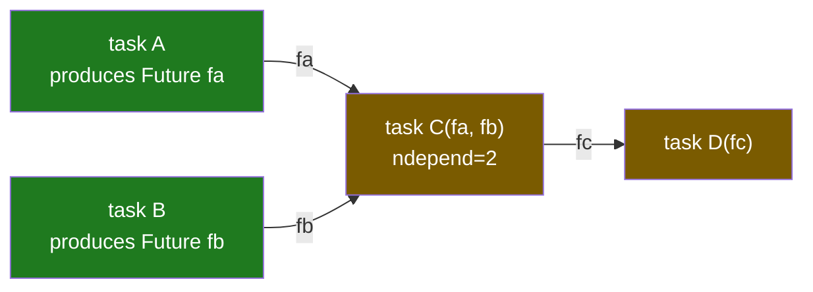
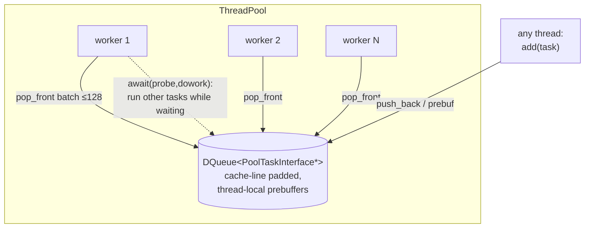

# Chapter 4 — Task queue & Futures

[← RMI thread](03-rmi-thread.md) · [Index](README.md) · [Next: GOP & fence →](05-gop-and-fence.md)

This is the dataflow engine. A **task** is a callable plus its argument
**futures**; it runs automatically when every input future is set. Futures wire
producers to consumers, including across ranks. This chapter covers `Future<T>`,
`DependencyInterface`, `TaskFn`, the `ThreadPool`, and the full lifecycle of a
remote task.

Files: `future.h`/`.cc`, `dependency_interface.h`, `taskfn.h`,
`world_task_queue.h`/`.cc`, `thread.h`/`.cc`, `dqueue.h`, `worldref.h`.

---

## 4.1 The dataflow model in one picture

You can submit a task whose inputs are the not-yet-computed outputs of other
tasks. The runtime tracks dependencies and fires each task exactly when ready —
no explicit scheduling on your part.



`C` is created with `ndepend = 2`; as `A` and `B` set their futures, callbacks
decrement it; at 0, `C` is pushed to the thread pool. When `C` runs it sets `fc`,
making `D` runnable.

---

## 4.2 `Future<T>`

A `Future<T>` (`future.h:368-712`) is a shallow handle to a reference-counted
`FutureImpl<T>` (`future.h:74-352`):

- `std::atomic<bool> assigned` (`future.h:95`) → **lock-free `probe()`**.
- an inline stack of up to 4 callbacks (`future.h:83`) — no heap allocation in the
  common case.
- `volatile T t` (`future.h:100`) — the stored value.
- `RemoteReference<FutureImpl<T>> remote_ref` (`future.h:98`) — set when this
  future's result must be shipped to another rank.

**Optimization:** a `Future` constructed already-assigned skips the `shared_ptr`
allocation entirely (`future.h:397-409`). Setting futures eagerly (e.g. from a
local value) is cheap.

### Setting a future fires its consumers

```mermaid
sequenceDiagram
    autonumber
    participant P as producer task
    participant F as FutureImpl<T>
    participant CB as registered callbacks<br/>(waiting tasks)
    P->>F: set(value)
    F->>F: store t; assigned = true (release)
    F->>CB: run assignment chain, then callbacks
    Note over CB: each callback is a waiting task's<br/>DependencyInterface::dec()
    alt remote_ref is set
        F->>F: AM set_handler ships value to owning rank
    end
```

`set_assigned()` (`future.h:149-178`) runs the assignment chain first, then
callbacks, **outside** the lock to avoid re-entrancy problems. `register_callback`
(`future.h:238-242`) invokes the callback immediately if the future is already
set.

### Remote futures

`remote_ref(World&)` (`future.h:671-677`) yields a `RemoteReference` you can send
to another rank. When the future is `set` and a `remote_ref` is present, the value
is shipped via the `set_handler` active message (`future.h:106-141, 253-264`) to
the rank holding the original future. This is exactly how a result computed on
rank B reaches the caller's future on rank A (§4.6).

---

## 4.3 Dependencies: `DependencyInterface`

`DependencyInterface` (`dependency_interface.h:100-380`) is the base of every task:

- `std::atomic<int> ndepend` (`:105`) — count of unsatisfied inputs; lock-free
  `probe()` returns `ndepend == 0`.
- `inc()` / `dec()` (`:250-284`) — adjust the count; when `dec()` hits 0 it
  collects callbacks and fires them outside the lock.
- a small inline callback stack (size 8) and a special `final_callback` used for
  task cleanup.

---

## 4.4 `TaskFn`: a callable + futures + a result

`TaskFn` (`taskfn.h:473-861`) bundles a function (or member function or functor),
up to **9 arguments**, and a result `Future`. On construction,
`check_dependencies()` (`taskfn.h:548-602`) inspects each argument:

```cpp
// for each argument that is a Future:
if (!fut.probe()) {            // not ready yet
    DependencyInterface::inc();        // one more dependency
    fut.register_callback(this);       // wake me when it's set
}
```

When all argument futures are set, `ndepend` reaches 0 and the task is submitted
to the pool. `run()` (`taskfn.h:857-860`) unwraps the now-ready arguments, calls
the function, and sets the result future — which fires the next layer of tasks.

> **Remote vs local rule:** a *local* task may depend on unset futures (the runtime
> waits). A *remote* task's arguments must already be ready, because they are
> serialized at submission time (`world_task_queue.h:920-924`).

---

## 4.5 The thread pool

`ThreadPool` (`thread.h:1166-1529`) is a process-wide singleton:



- Worker count = `MAD_NUM_THREADS − 1` (`thread.cc:325-346`).
- The ready queue is a `DQueue` (`dqueue.h:79-349`): a cache-line-padded,
  dynamically growing deque with **thread-local prebuffers** (`MADNESS_DQ_USE_PREBUF`)
  to cut lock contention; workers pop in batches up to `nmax = 128`
  (`thread.h:1192, 1255`) but cap each pop at `~size/64` to avoid starving peers
  (`dqueue.h:290`).
- `ThreadPool::await(probe, dowork)` (`thread.h:1449-1505`) is the universal wait:
  while blocked on a condition (e.g. `Future::get`), a thread **steals and runs
  other ready tasks** instead of idling. Spin vs sleep is set by the wait policy;
  `ENABLE_NEVER_SPIN` forces sleeping (use when oversubscribed or debugging
  livelock).

---

## 4.6 Lifecycle of a remote task

`taskq.add(dest, fn, args...)` with `dest != me` ships the task to another rank.
End to end:

```mermaid
sequenceDiagram
    autonumber
    participant A as rank A (caller)
    participant AM as active message
    participant B as rank B (owner)
    participant Pool as B's thread pool
    A->>A: result = Future&lt;R&gt;; ref = result.remote_ref(world)
    A->>AM: send_task: pack TaskHandlerInfo{ref, fn, attr} + args (UNORDERED)
    AM->>B: remote_task_handler<taskT>(arg)
    B->>B: deserialize info + args; new TaskFn(Future(ref), fn, attr, arch)
    B->>Pool: taskq.add(task)
    Pool->>Pool: run task → value
    Pool->>B: task's result Future has remote_ref → set_handler AM
    B->>A: set_handler ships value
    A->>A: result future is set → A's dependent tasks fire
```

References:
`send_task` (`world_task_queue.h:423-439`), `remote_task_handler`
(`world_task_queue.h:352-369`), result delivery (`future.h:106-141`).

**Cost note.** A remote task costs: argument serialization + one AM there + one AM
back (the result) + the future-callback chain on both ends. The `RemoteReference`
increments a reference count on serialization and releases on destruction
(`worldref.h`), keeping the result future alive until the value is delivered.

---

## 4.7 Tasks that target data: `taskq` vs `WorldContainer::task`

You rarely call `taskq.add(dest, …)` with an explicit rank in MRA code. Instead you
say "run this on whichever rank owns key K" via `container.task(key, memfun, …)`
(Chapter 6). That computes `owner(key)` from the pmap and dispatches a remote task
there. **This is how operations follow data**: a tree-sweep task for node K is sent
to the rank that stores node K.

---

## 4.8 MacroTaskQ (subworld pools)

`MacroTaskQ` (`mra/macrotaskq.h`) is a higher-level scheduler that splits the
universe `World` into **subworlds**, each a pool of ranks that pulls "macrotasks"
from a shared queue. Macrotasks carry only metadata; bulk inputs/outputs live in a
separate `Cloud` container, so large `Function`s are passed by reference rather
than serialized. Results are accumulated with `gaxpy`. This is the substrate for
molresponse_v2 `state_parallel "on"` mode — each subworld solves a subset of
response states with minimal cross-subworld traffic.

[← RMI thread](03-rmi-thread.md) · [Index](README.md) · [Next: GOP & fence →](05-gop-and-fence.md)
