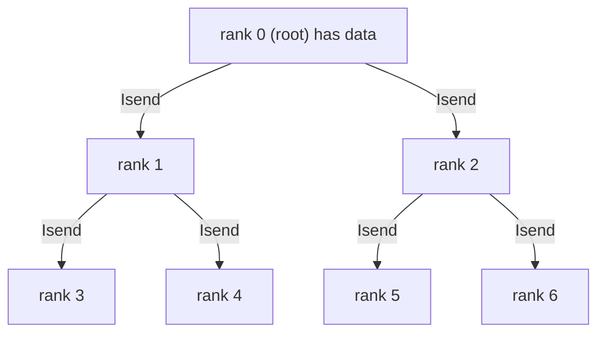
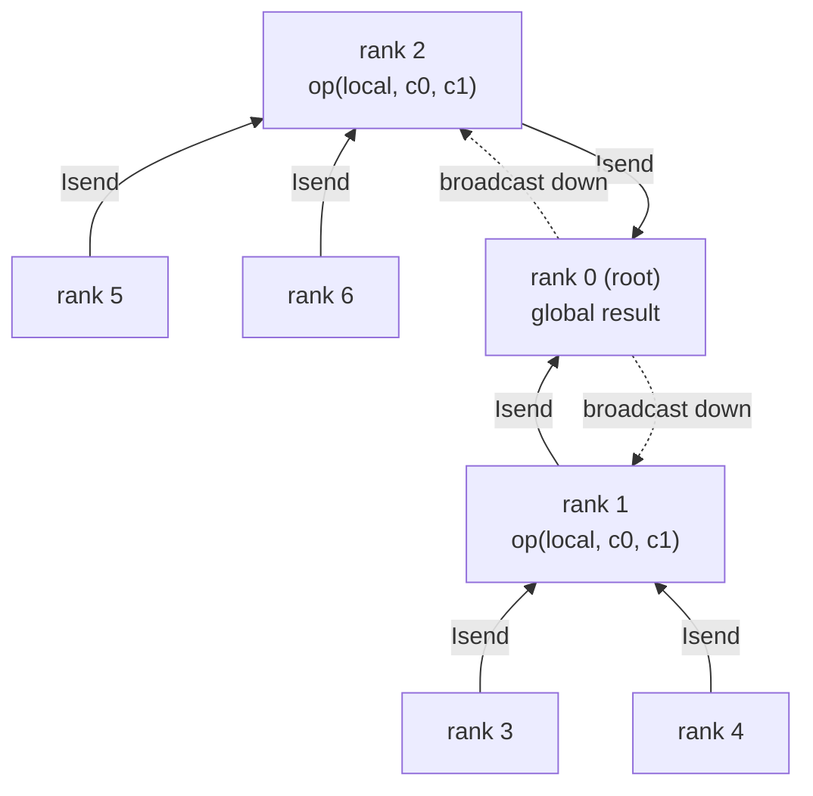
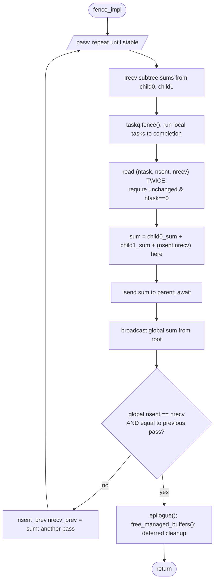

# Chapter 5 — Global operations & `fence()`

[← TaskQueue & Futures](04-taskq-futures.md) · [Index](README.md) · [Next: WorldContainer →](06-worldcontainer.md)

`WorldGopInterface` (`worldgop.h`/`.cc`) provides the collectives — `broadcast`,
`reduce`/`sum`, `barrier`, and the all-important `fence()`. All of them are built
on a **binary tree over ranks** out of `Isend`/`Irecv`, not `MPI_Bcast`/`MPI_Reduce`,
so they interleave cleanly with the task pool and with termination detection.

---

## 5.1 The binary tree

`binary_tree_info(root, parent, child0, child1)` (`safempi.h:863`) gives each rank
its parent and up to two children for a tree rooted at `root`. For `P` ranks the
tree has depth `⌈log₂ P⌉`.

```
                 rank 0 (root)
                /            \
            rank 1            rank 2
           /     \           /     \
       rank 3   rank 4   rank 5   rank 6   ...
```

---

## 5.2 Broadcast

`broadcast(buf, nbyte, root)` (`worldgop.cc:173-208`): each non-root rank `Irecv`s
from its parent, then `Isend`s to its (≤2) children.



- Depth `O(log P)`, total `O(P)` messages.
- Large payloads are chunked by `MAD_MAX_REDUCEBCAST_MSG_SIZE` (`worldgop.cc:202-207`).
- `World::await(req, dowork=true)` is used between steps, so a waiting rank runs
  pool tasks rather than idling.

---

## 5.3 Reduce / sum

`reduce`/`sum` is the mirror image: leaves send up, each internal rank combines its
local value with both children's, the root broadcasts the result down.



- Depth `O(log P)`, `~2P` messages. `barrier()` is a `sum` of ranks with a
  consistency check (`worldgop.h:702-706`).
- This single all-reduce is the *entire* communication cost of `inner()`
  (Chapter 8).

---

## 5.4 `fence()` — global quiescence detection

`fence()` is the operation boundary: it returns only when **all tasks everywhere
are done and there are no active messages still in flight.** It is *not* a simple
barrier — work in progress can spawn new tasks and new messages, so it uses
Dijkstra-style termination detection over the binary tree (`fence_impl`,
`worldgop.cc:50-159`).



Why two passes minimum:

1. **Local quiescence.** `taskq.fence()` drains local tasks. Then it reads
   `taskq.size()`, `am.nsent`, `am.nrecv` **twice** with a compiler barrier between
   (`worldgop.cc:89-101`); they must be unchanged and `ntask == 0`. (They live in
   different critical sections, so the double-read is how it gets a consistent
   snapshot without a global lock.)
2. **Global agreement.** Subtree sums of `nsent`/`nrecv` flow up; the global pair
   is broadcast down (`worldgop.cc:105-122`).
3. **Termination.** It exits only when `global_nsent == global_nrecv` **and** that
   value is identical to the previous pass (`worldgop.cc:128-132`). A clean program
   converges in ~2 passes; a straggler that emits a message during the pass forces
   another round.

Because `nsent` increments at send and `nrecv` increments **after** the handler
runs (Chapter 2), `nsent == nrecv` globally means every message has been fully
processed — including any work its handler queued.

**Cost:** `O(log P)` messages of 16 bytes per pass, times the number of passes.
Each fence is a hard synchronization point and a `free_managed_buffers` + deferred
cleanup site. **Minimizing the number of fences is a primary optimization lever**
(Chapters 8–9).

### `forbid_fence_` and nested fences

Fencing from inside a task (i.e. on a worker thread) is dangerous — it can
deadlock the very pool that must make progress. `fence_impl` asserts
`not forbid_fence_` (`worldgop.cc:54`). Collective state changes that must be
globally visible use `serial_invoke` (fence → action → fence,
`worldgop.cc:165-171`).

---

## 5.5 Summary for modeling

| Collective | Messages | Bytes/msg | Depth | Appears in |
|------------|----------|-----------|-------|------------|
| broadcast | `O(P)` | chunked by `MAD_MAX_REDUCEBCAST_MSG_SIZE` | `O(log P)` | redistribute, replicate, fence |
| reduce/sum | `~2P` | element size | `O(log P)` | `inner`, norms, `tree_size` |
| barrier | `~2P` | 8 B | `O(log P)` | explicit sync |
| fence | `O(log P)`/pass × passes | 16 B | `O(log P)` | **every operation boundary** |

[← TaskQueue & Futures](04-taskq-futures.md) · [Index](README.md) · [Next: WorldContainer →](06-worldcontainer.md)
