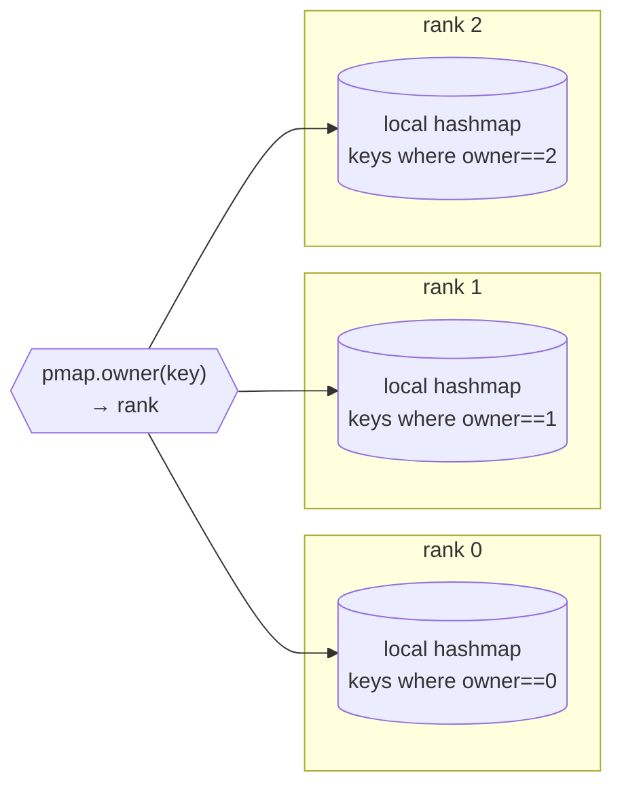
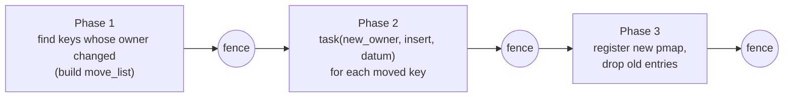

# Chapter 6 — WorldContainer: the distributed hash map

[← GOP & fence](05-gop-and-fence.md) · [Index](README.md) · [Next: Function & tree →](07-function-and-tree.md)

`WorldContainer<keyT,valueT>` is the one distributed data structure in MADWorld.
Everything distributed — including every `Function`'s coefficient tree — is a
container. Understanding it is the bridge between the generic runtime and the MRA
layer.

Files: `worlddc.h`, `worldhashmap.h`.

---

## 6.1 Data model

`WorldContainer` (`worlddc.h:1125-2046`) is a shallow handle over
`WorldContainerImpl` (`:528-1098`), which **is a `WorldObject`** (so it can be the
target of remote method active messages). Each rank stores only the keys it owns,
in a thread-safe `ConcurrentHashMap<keyT,valueT>` (`:542, 571`).



**The pmap is the distribution.** `owner(key)` (`worlddc.h:810-813`) delegates to
`WorldDCPmapInterface::owner(key)` (`:135`). There is no global index — to find a
key you compute its owner and ask that rank.

| pmap | rule | distribution | source |
|------|------|--------------|--------|
| `WorldDCDefaultPmap` | `hash(key) % nproc` | balanced, scattered | `:248-267` |
| `WorldDCLocalPmap` | always `me` | fully replicated | `:272-289` |
| `WorldDCNodeReplicatedPmap` | lowest rank on node | one copy per node | `:295-315` |

For functions, the MRA layer supplies its own key-aware pmaps (`SimplePmap`,
`LevelPmap`, `LBDeuxPmap`) — Chapter 7.

---

## 6.2 Local vs remote access

This table is the whole performance story of the container:

| Operation | Local (owner == me) | Remote (owner != me) |
|-----------|---------------------|----------------------|
| `find(key)` | immediate `Future` (no comm) | **2 messages**: request → owner, reply ← owner |
| `insert`/`replace` | hashmap insert under write lock | **1 message**: fire-and-forget to owner |
| `send(key, memfun, …)` | direct call under lock | request → owner runs method → reply |
| `task(key, memfun, …)` | enqueue on local pool | **1 message**: enqueue on owner's pool |

### Remote `find` round-trip

```mermaid
sequenceDiagram
    autonumber
    participant A as rank A (caller)
    participant B as rank B = owner(key)
    A->>A: result = Future&lt;iterator&gt;
    A->>B: find_handler(me, key, result.remote_ref) [AM]
    B->>B: local.find(key)
    alt found
        B->>A: find_success_handler(pair) [AM] → sets future to iterator
    else not found
        B->>A: find_failure_handler() [AM] → sets future to end()
    end
```

`find` (`worlddc.h:919-943`), handlers (`:575-608`). The caller gets a `Future`
immediately and continues; the value materializes when the reply arrives. **Never
assume `find` is cheap on a remote key — it is a full round trip.**

### `send` vs `task`

Both invoke a method *on the value that owns `key`*, wherever it lives — the object
is never serialized, only the method id and arguments travel
(`worlddc.h:1459-1699` for `send`, `:1701-1967` for `task`). The difference:

- **`send`** runs the method as soon as the AM is handled.
- **`task`** enqueues it on the owner's task queue, so it can have **future
  dependencies** (for local targets) and integrate with the dataflow graph.

MRA tree sweeps use `task` heavily: "run `reconstruct_op` on the owner of child
key K, when its inputs are ready."

---

## 6.3 Iteration is local only

`begin()`/`end()` (`worlddc.h:899-917`) iterate **only this rank's** data — there
is no global iteration without communication. Operations that must touch every
node either (a) iterate locally on each rank and combine with a `gop` reduction
(e.g. `inner`, `norm`, `tree_size`), or (b) walk the tree by `task`-dispatching to
owners (e.g. `compress`, `apply`).

---

## 6.4 Changing the distribution: `redistribute`

When the pmap changes (e.g. after load balancing, Chapter 7), data must move to new
owners. `redistribute` (`worlddc.h:169-197`) is a 3-phase, 3-fence collective:



Cost ≈ `O(local_size)` per rank plus the bytes of moved values; three global
fences. `replicate()` / `replicate_on_hosts()` (`:643-769`) are related collectives
that broadcast all data to every rank / every node.

---

## 6.5 Why this matters for functions

A `Function`'s coefficient tree is a `WorldContainer<Key, FunctionNode>`. So:

- "How is the function distributed?" = "what does its pmap do with keys?"
- "How expensive is a tree sweep?" = "how many parent↔child edges cross rank
  boundaries (each = a `task`/`find` message), plus one fence."
- "How do I rebalance?" = "build a new pmap with `LoadBalanceDeux` and
  `redistribute`."

That is the subject of Chapter 7.

[← GOP & fence](05-gop-and-fence.md) · [Index](README.md) · [Next: Function & tree →](07-function-and-tree.md)
