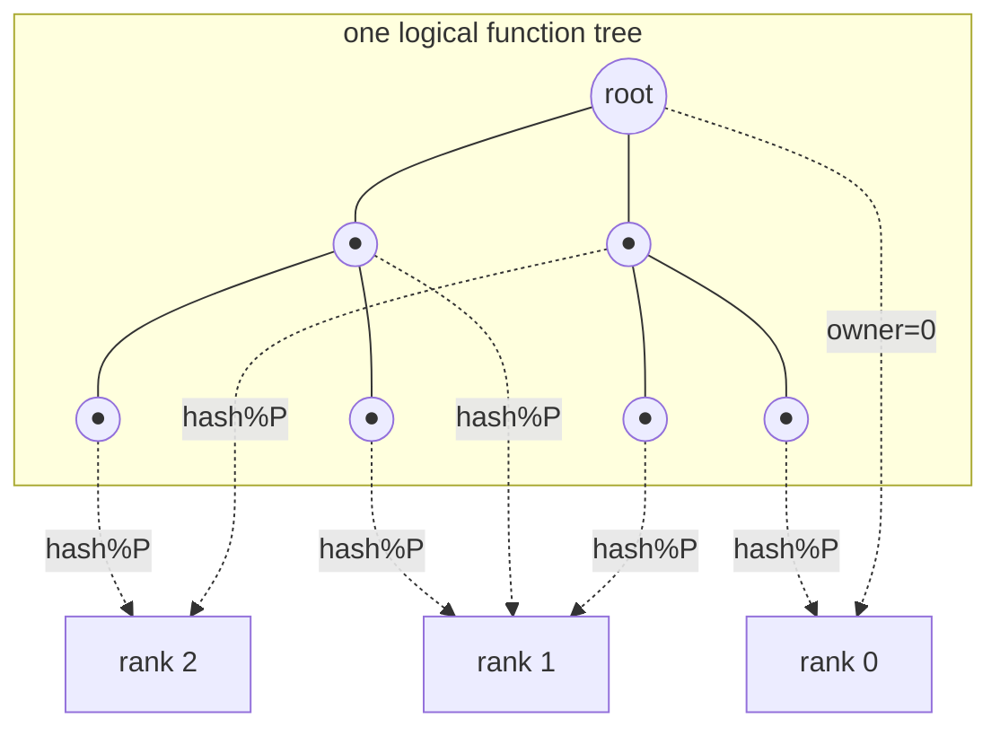
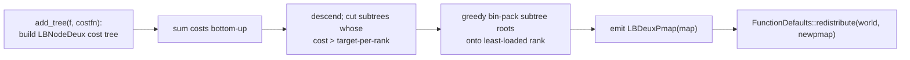

# Chapter 7 — Function representation & tree distribution

[← WorldContainer](06-worldcontainer.md) · [Index](README.md) · [Next: Operations →](08-operations.md)

This chapter explains what a `Function` actually *is*: an adaptive
`2^d`-ary tree of coefficient tensors, stored in a `WorldContainer`, distributed by
a key-aware pmap. Once you see this, every operation in Chapter 8 is "a tree sweep
over a distributed container."

Files: `mra.h`, `funcimpl.h`, `mraimpl.h`, `key.h`, `funcdefaults.h`,
`function_common_data.h`, `lbdeux.h`.

---

## 7.1 Handle vs implementation

```cpp
Function<T,NDIM>           // mra.h:138-200 — shallow handle
   └─ std::shared_ptr<FunctionImpl<T,NDIM>> impl;   // mra.h:146
FunctionImpl<T,NDIM>       // funcimpl.h:945-1063 — the real state
   ├─ int    k;            // wavelet order
   ├─ double thresh;       // truncation threshold
   ├─ FunctionCommonData<T,NDIM>& cdata;   // shared filters/quadrature for this k
   └─ WorldContainer<Key<NDIM>, FunctionNode<T,NDIM>> coeffs;  // THE TREE
```

Copying a `Function` is a shallow pointer copy; destruction defers cleanup to the
next fence. All real work lives in `FunctionImpl` and its `coeffs` container.

---

## 7.2 The adaptive tree

The domain is recursively bisected in every dimension. Each box is named by a
`Key<NDIM>` (`key.h:70-175`): a level `n` and an integer translation vector `l` of
length `d`. Navigation:

- root: `Key(0, {0,…,0})`
- children: `2^d` of them, translation `l*2 + offset`, `offset ∈ {0,1}^d`
- parent: `Key(n-1, l>>1)` (`key.h:289-297`)

```
 level 0:            ●  (root)
                   / | | \         (2^d children; shown as 4 for d=2)
 level 1:        ●   ●  ●   ●
                /|\         ...     adaptive: only refine where needed
 level 2:     ● ● ●  (leaves carry coefficients)
```

Each node is a `FunctionNode<T,NDIM>` (`funcimpl.h:126-495`): a coefficient tensor
`coeffT _coeffs` (a possibly low-rank `GenTensor`), a `has_children` flag, and
norms. Tensor sizes:

| Node kind | Coefficients | Bytes (double) |
|-----------|--------------|----------------|
| reconstructed leaf | `k^d` scaling | `8·k^d` |
| compressed internal | `(2k)^d` (scaling+wavelet) | `8·(2k)^d` |

For `d=3`, a leaf is `8·k³` bytes — the number that drives the memory model
(companion doc §11).

### Tree states

`TreeState` (`funcdefaults.h:59-69`) records where coefficients live:
`reconstructed` (scaling at leaves), `compressed` (wavelets in internal nodes),
`nonstandard`/`redundant` variants (used by products and operator application),
and `on_demand` (no stored coefficients — computed lazily from a functor).
Operations require specific input states; that is why `compress`/`reconstruct`
bracket so much code.

---

## 7.3 The distribution = the pmap over keys

Because the tree is a `WorldContainer<Key, FunctionNode>`, **a function is
distributed exactly the way its pmap maps keys to ranks**
(`FunctionDefaults<NDIM>::get_pmap()`, `funcdefaults.h:401-447`).



| pmap | rule | locality | balance | source |
|------|------|----------|---------|--------|
| `SimplePmap` | root→0, else `key.hash() % nproc` | poor (parent & child usually on different ranks) | excellent | `funcimpl.h:84-101` |
| `LevelPmap` | odd-level children co-located with even-level parent | good for two-scale transforms | good | `funcimpl.h:103-122` |
| `LBDeuxPmap` | explicit `map<Key,ProcessID>`; walk up to nearest mapped ancestor | whole subtrees on one rank | tuned by cost functor | `lbdeux.h:57-91` |

**Implication for Chapter 8:** with `SimplePmap`, nearly every parent↔child edge in
a tree sweep crosses a rank boundary → one message per edge. With `LevelPmap` or
`LBDeuxPmap`, far fewer edges cross → less communication, at the cost of balance
quality.

---

## 7.4 Load balancing: `LoadBalanceDeux`

`LoadBalanceDeux` (`lbdeux.h:227-397`) builds an explicit, balanced pmap from a
**cost functor** you supply: `double(const Key&, const FunctionNode&)` — commonly
`node.coeff().size()` (`vmra.h`). Algorithm:



The cost functor is the tuning surface: count coefficients (memory balance), or
weight by estimated flops of the dominant op (time balance). After `redistribute`
(Chapter 6), subsequent operations see the new layout. **Load balance enters every
performance model as the imbalance factor `φ = N_max_rank · P / N`.**

---

## 7.5 How big is the tree?

There is no closed form for `N_leaf`; it depends on the function's smoothness,
`k`, `thresh`, and `d`. Empirically (companion doc, `CLAUDE.md`):

- Smooth functions → few, shallow nodes; singular/oscillatory → deep, many nodes.
- Refining `k` 6→10 at fixed accuracy raises `N_leaf` ~4.6× (measured) *and* raises
  per-node bytes by `(10/6)³ ≈ 4.6×` — an order of magnitude at the final protocol.
- `tree_size()` (`mraimpl.h:1882-1887`) returns the global node count via
  `coeffs.size()` + `gop.sum`; per-rank `coeffs.size()` gives the imbalance factor.

`FunctionDefaults<NDIM>` (`funcdefaults.h:99-451`) holds the knobs that control all
of this: `k`, `thresh`, `initial_level`, `max_refine_level`, `special_level`,
`truncate_mode`, `autorefine`, tensor type, and the pmap. Chapter 9 covers how to
set them per operation.

[← WorldContainer](06-worldcontainer.md) · [Index](README.md) · [Next: Operations →](08-operations.md)
