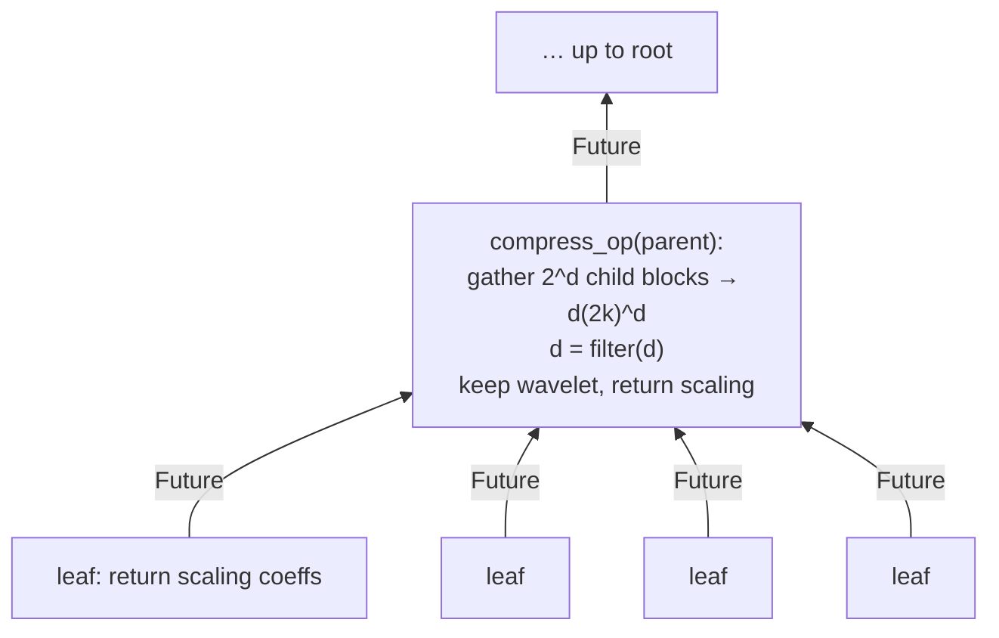
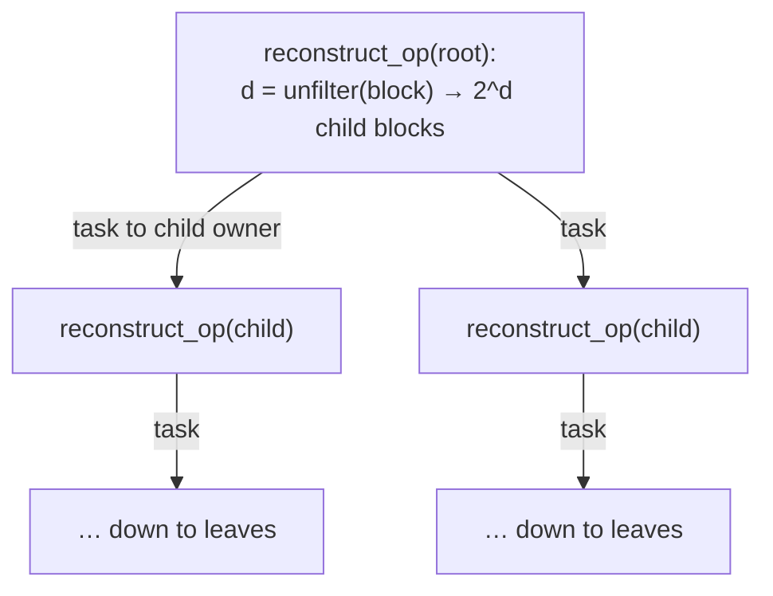
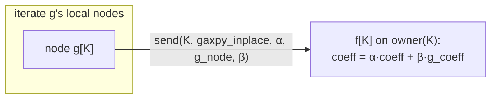
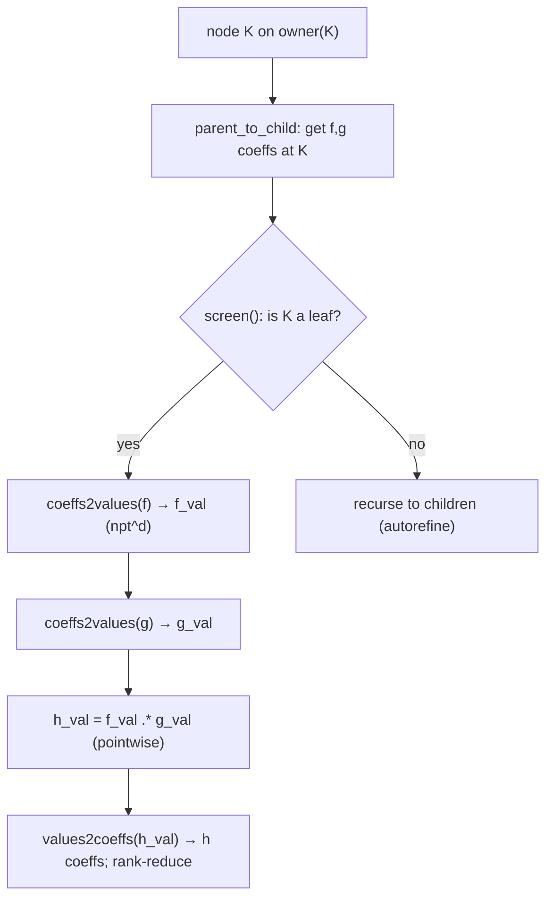
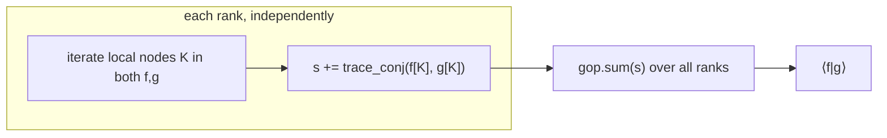
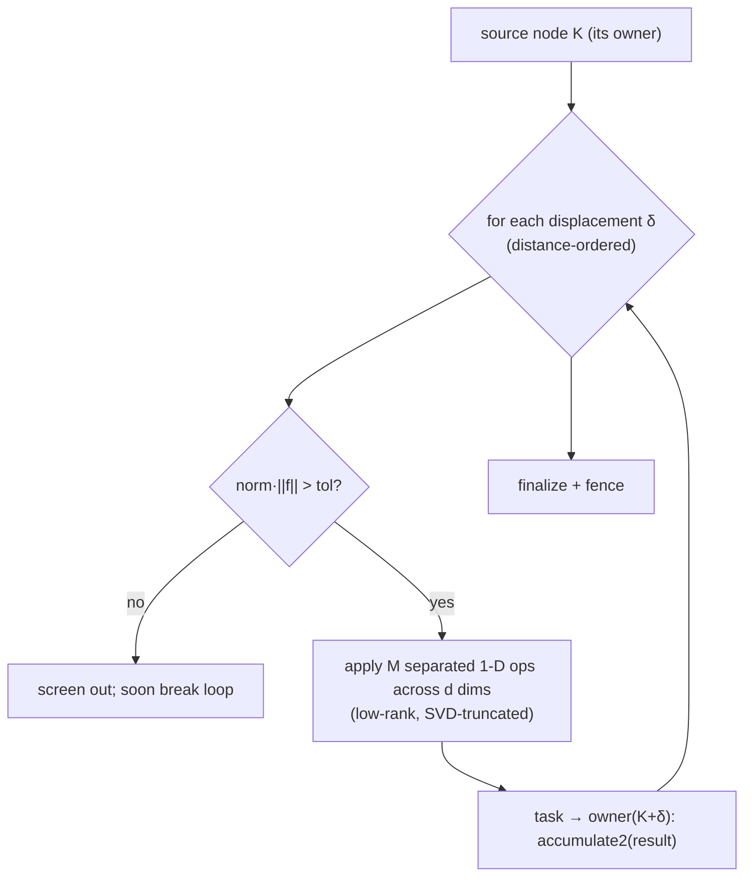
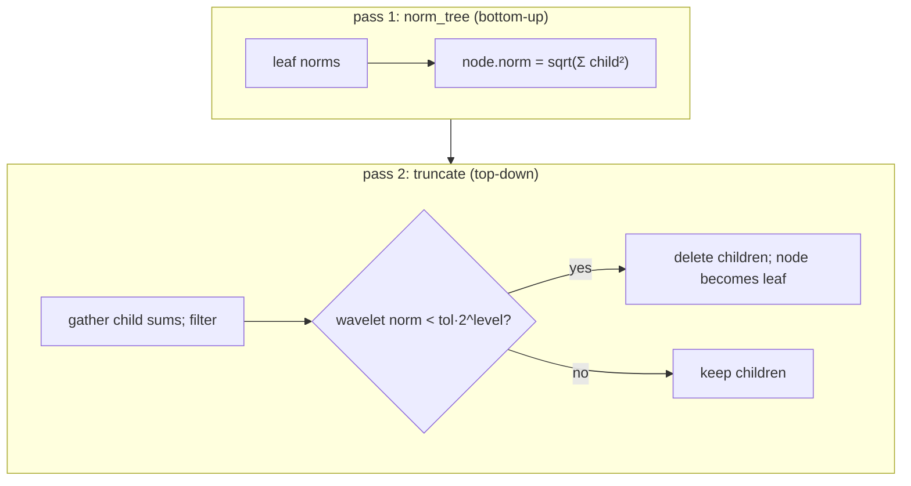

# Chapter 8 — Operations, piece by piece

[← Function & tree](07-function-and-tree.md) · [Index](README.md) · [Next: Parameter tuning →](09-parameter-tuning.md)

Every core operation is a **distributed tree sweep**: tasks walk the
`WorldContainer<Key,FunctionNode>`, one (or a few) per node, dispatched to the rank
that owns each key, separated by a `fence()`. This chapter dissects each operation:
what it computes, how the sweep flows, what crosses the wire, and the per-node flop
cost.

Recurring primitive — the **separable transform**: applying a `k×k` (or `2k×2k`)
matrix along each of the `d` axes of a size-`k^d` tensor costs `Θ(d·k^{d+1})`. This
shows up in compress, reconstruct, multiply, apply, and truncate.

Files: `funcimpl.h`, `mraimpl.h`, `operator.h`, `vmra.h`.

Cost legend: `c_node` = per-node flops; "edges" = parent↔child links that cross a
rank boundary (each ≈ one task/AM).

---

## 8.1 `compress` — leaves → wavelet form (bottom-up)

**What:** convert `reconstructed` (scaling coefficients at leaves) to `compressed`
(wavelet differences in internal nodes) by applying the two-scale filter up the
tree.

**Sweep:** `compress` (`mraimpl.h:1500-1514`) → `compress_spawn(root)`
(`mraimpl.h:3268-3328`). Each node spawns `compress_spawn` **on the owners of its
`2^d` children**, collects their sum-coefficient futures, assembles a `(2k)^d`
tensor, applies `filter()` (`mraimpl.h:1684`), keeps the wavelet block locally, and
returns the scaling block to its parent.



| Aspect | Value |
|--------|-------|
| Direction | bottom-up (children → parent) |
| Task placement | `compress_spawn` runs on each **child's owner** |
| Communication | one task + one returned future per cross-rank edge |
| `c_node` | one filter ⇒ `Θ(d·k^{d+1})`; temp `O((2k)^d)` |
| Sync | one `fence` at the end |

---

## 8.2 `reconstruct` — wavelet form → leaves (top-down)

**What:** the inverse of compress. Expand each internal node's `(2k)^d` block back
into child scaling coefficients via the inverse two-scale filter.

**Sweep:** `reconstruct` (`mraimpl.h:1468-1490`) → `reconstruct_op(root, …)`
(`mraimpl.h:2079-2130`). A node `unfilter()`s its block (`mraimpl.h:2108`) and ships
each child's scaling block to **that child's owner** via `task` (`mraimpl.h:2111-2116`),
which recurses.



| Aspect | Value |
|--------|-------|
| Direction | top-down (parent → children) |
| Task placement | `reconstruct_op` runs on each **child's owner** |
| Communication | one task per cross-rank edge (carries a child block) |
| `c_node` | one unfilter ⇒ `Θ(d·k^{d+1})` |
| Sync | one `fence` at the end |

> compress/reconstruct are pure **state changes**. They dominate when you toggle
> representation repeatedly; batch operations to avoid needless round-trips
> (Chapter 9).

---

## 8.3 `gaxpy` / `+` / `−` — linear combination

**What:** `c = α·f + β·g`, both in the same state. Tree alignment: nodes present in
only one operand are copied; shared nodes are combined.

**Sweep:** `gaxpy_inplace` (`funcimpl.h:1212-1300`): iterate `g`'s **local** nodes;
for each, `coeffs.send(key, &FunctionNode::gaxpy_inplace, α, node, β)` to the owner
of that key in `f` (`funcimpl.h:1275`), creating the node if absent. One fence.



| Aspect | Value |
|--------|-------|
| Direction | per-node, no parent/child coupling |
| Communication | `O(N)` `send` AMs (only where `g[K]` and `f`'s owner of K differ) |
| `c_node` | tensor axpy: `Θ(r·k^d)` low-rank, `O(k^d)` full |
| Sync | one `fence` |

If `f` and `g` share a pmap (the common case for same-defaults functions), most
`send`s are local. Mismatched pmaps make gaxpy chatty.

---

## 8.4 `multiply` — pointwise product

**What:** `h(x) = f(x)·g(x)`. Products are local in *value* space, not coefficient
space, so inputs must be **reconstructed**. Per node: transform coefficients →
values on the quadrature grid, multiply pointwise, transform back.

**Sweep:** `multiply_op` (`funcimpl.h:3492-3597`), descent via `forward_traverse`
(`funcimpl.h:3654-3680`). On each node's owner:



| Aspect | Value |
|--------|-------|
| Direction | top-down with refinement; per-node local compute |
| Communication | **none** for the multiply itself (operates on locally pulled coeffs) + fence |
| `c_node` | two separable transforms `Θ(d·k^{d+1})` (npt≈k) + `Θ(npt^d)` pointwise |
| Sync | one `fence` |
| Knob | `autorefine` adds nodes to preserve accuracy — more nodes, more cost |

---

## 8.5 `inner` — inner product `⟨f|g⟩`

**What:** scalar `∫ f g`. Inputs reconstructed or redundant.

**Sweep:** `inner_local` (`funcimpl.h:5624-5680`): iterate **local** nodes; for keys
present in both `f` and `g`, accumulate `trace_conj` of the two tensors
(`O(k^d)` each). Local sum via the task queue, then **one global `gop.sum`**.



| Aspect | Value |
|--------|-------|
| Direction | local iteration only |
| Communication | **one all-reduce**, `O(log P)` |
| `c_node` | `Θ(k^d)` per shared node |
| Sync | the reduce *is* the sync (no separate fence needed) |

This is the cheapest-communication core op — the template for any "reduce over the
tree" quantity (norms, overlaps).

---

## 8.6 `apply` — separated convolution (the expensive one)

**What:** `g = ∫ K(x,y) f(y) dy`, with the kernel `K` written as a sum of `M`
separated (per-dimension product) terms — BSH, Coulomb/Poisson, etc. Output is in
non-standard form.

**Sweep:** for each source node, loop over a precomputed, distance-ordered
**displacement list** (`Displacements::get_disp`, `funcimpl.h:5156`). Each
displacement maps the source to a target node (possibly on another rank); the
separated kernel is applied across dimensions (`muopxv_fast2`,
`operator.h:1480-1481`), with SVD rank truncation between terms. Screening
(`funcimpl.h:5175-5184`) skips negligible displacements and, because they are
distance-ordered, breaks the loop early. Results are accumulated at the target via
`coeffs.task(dest, &FunctionNode::accumulate2, …)` (`funcimpl.h:5783`).



```
 displacement stencil (2-D slice, source at center):
        ┌───┬───┬───┬───┬───┐
        │   │ · │ · │ · │   │      · = candidate target before screening
        ├───┼───┼───┼───┼───┤      survivors D_eff shrink with distance
        │ · │ ▣ │ ▣ │ ▣ │ · │      ▣ = near shell (usually survives)
        ├───┼───┼───┼───┼───┤
        │ · │ ▣ │ S │ ▣ │ · │      S = source box
        ├───┼───┼───┼───┼───┤
        │ · │ ▣ │ ▣ │ ▣ │ · │
        ├───┼───┼───┼───┼───┤
        │   │ · │ · │ · │   │
        └───┴───┴───┴───┴───┘
```

| Aspect | Value |
|--------|-------|
| Direction | source → multiple targets (stencil) |
| Communication | one `task` per (source, surviving-δ) whose target is remote — **the heaviest traffic of any op**; carries coefficient tensors |
| `c_node` | `Θ(D_eff · M · d · k^{d+1})` full-rank; low-rank replaces one `k^{d+1}` with `M·k·r` |
| Sync | finalize + one `fence` |
| Knobs | operator `thresh` (sets `M` and screening), tensor type (low-rank), pmap (target locality) |

`apply` dominates both compute and network in SCF/response iterations. Its target
traffic is the main reason a locality-aware pmap (LevelPmap/LBDeux) matters.

---

## 8.7 `truncate` — norm-based pruning

**What:** drop nodes whose wavelet norm is below tolerance, promoting parent scaling
coefficients to new leaves. Reduces `N_leaf` (and memory) after operations that grow
the tree.

**Sweep:** two passes (`mraimpl.h:1545-1658`):

1. `norm_tree` — bottom-up: each node stores `sqrt(Σ child_norm²)`
   (`mraimpl.h:1554-1567`).
2. `truncate_reconstructed_spawn/op` — top-down: gather child sums, `filter`,
   compute the wavelet-block norm; if `< truncate_tol(tol,key)=tol·2^{level}`,
   delete children and keep the scaling block (`mraimpl.h:1617-1658`).



| Aspect | Value |
|--------|-------|
| Direction | bottom-up then top-down (two sweeps) |
| Communication | child-sum tasks per cross-rank edge; light (sum coeffs only) |
| `c_node` | filter `Θ(d·k^{d+1})` + norms `O(k^d)` |
| Sync | **two fences** (one per sweep) |
| Knob | `truncate_mode` controls how `truncate_tol` scales with level |

---

## 8.8 At-a-glance cost & communication

| Op | `c_node` | Sweep | Communication | Fences |
|----|----------|-------|---------------|--------|
| compress | `d·k^{d+1}` | bottom-up | tasks on cross-rank edges | 1 |
| reconstruct | `d·k^{d+1}` | top-down | tasks on cross-rank edges | 1 |
| gaxpy | `r·k^d` | per-node | `O(N)` AMs (pmap-dependent) | 1 |
| multiply | `d·k^{d+1}` | per-node + refine | none | 1 |
| inner | `k^d` | local + reduce | **1 all-reduce** | 0 (reduce) |
| apply | `D_eff·M·d·k^{d+1}` | stencil | `O(N·D_eff)` tasks (heavy) | 1 |
| truncate | `d·k^{d+1}` | 2 sweeps | child-sum tasks | 2 |

The two levers visible here drive Chapter 9: **`k`/`d` set per-node cost
(`k^{d+1}`)**, and **the pmap sets how many edges/targets cross the wire**.

[← Function & tree](07-function-and-tree.md) · [Index](README.md) · [Next: Parameter tuning →](09-parameter-tuning.md)
