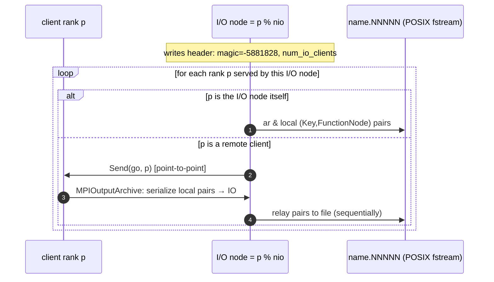
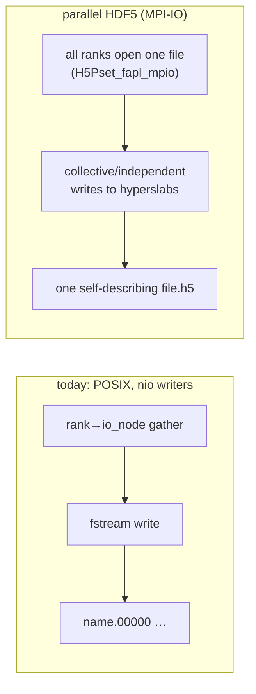

# Chapter 10 — Parallel function I/O & an HDF5 path

[← Parameter tuning](09-parameter-tuning.md) · [Index](README.md) · [Performance models →](../parallel_runtime_and_performance_models.md)

How MADNESS gets `Function`s (and vectors of them — orbitals, response states) to
and from disk, what the current architecture costs at scale, and a concrete
analysis of how HDF5 + parallel I/O (MPI-IO) would change the picture. This
chapter matters for checkpoint/restart of large systems — exactly the regime the
HF/exchange refactor and the >20-orbital scaling goal push into.

Files: `archive.h`, `parallel_archive.h`, `binary_fstream_archive.h`,
`vector_archive.h`, `mpi_archive.h`, `worlddc.h` (container store/load), `mra.h`,
`funcimpl.h`, `vmra.h`, `chem/SCF.cc`, `molresponse_v2/ResponseIO.hpp`, and the
HDF5 proof-of-concept in `src/examples/writecoeffs/`.

---

## 10.1 The archive abstraction

Serialization is a compile-time-dispatched template system rooted at `BaseArchive`
(`archive.h:358-388`). The single operator you use is `ar & object`
(`archive.h:811-840`), which routes through
`ArchiveImpl<Archive,T>::wrap_store/wrap_load` → `preamble` → `ArchiveStoreImpl::store`
→ `postamble`. Specializing `ArchiveStoreImpl<Archive,T>` is how a type teaches the
system to serialize itself; that is exactly how `WorldContainer` plugs in (§10.3).

Backends (all share the `ar &` interface):

| Archive | Backing store | Role |
|---------|---------------|------|
| `BufferOutput/InputArchive` | raw memory (+ count-only mode) | local staging, size pre-pass |
| `VectorOutput/InputArchive` | `std::vector<unsigned char>` | growable in-memory buffer |
| `BinaryFstreamOutput/InputArchive` | POSIX `std::ofstream` (4 MB buf, `binary_fstream_archive.h:54`) | **the disk backend** |
| `MPIOutput/InputArchive` | MPI `Send`/`Recv` | rank→rank transfer (not disk) |
| `ParallelOutput/InputArchive` | wraps a local backend across ranks | the parallel coordinator (§10.3) |

There is **no MPI-IO backend** — `grep` for `MPI_File_*` across the tree returns
nothing. All disk writes are POSIX `fstream` from a few designated ranks.

---

## 10.2 What gets written for one `Function`

`madness::save(f, name)` / `load` (`mra.h:2901-2910`) wrap the function in a
`ParallelOutputArchive<BinaryFstreamOutputArchive>` and do `ar & f`. The serialized
layout (`mra.h:1533-1576`, `funcimpl.h:1305-1332`, `funcimpl.h:457-460`):

```
 Function archive
 ├─ header (rank 0):  magic=7776769 · type id · NDIM · k · cell tensor
 └─ FunctionImpl::store
    ├─ k · thresh · initial_level · max_refine_level · truncate_mode
    │  · autorefine · truncate_on_project · tree_state
    └─ coeffs:  WorldContainer<Key, FunctionNode>      ← the tree (§10.3)
           each FunctionNode::serialize:
              coeff() (GenTensor)  ·  _has_children  ·  _norm_tree  ·  dnorm  ·  snorm
```

So a function file is its metadata plus one `(Key, FunctionNode)` record per tree
node, each carrying a `k^d` (leaf) or low-rank coefficient tensor. Size:

```
 bytes(f) ≈ N_leaf · k^d · 8   +   N_node · node_overhead(~50 B)
```

---

## 10.3 The parallel archive model

`ParallelOutputArchive` (`parallel_archive.h`) coordinates many ranks writing one
logical dataset. The core policy is **`nio` I/O nodes** and a round-robin
assignment of every rank to one of them:

```cpp
ProcessID io_node(ProcessID rank) const { return rank % nio; }   // parallel_archive.h:99-101
```

- **Files:** one physical file per I/O node, named `name.NNNNN` (5-digit rank of the
  I/O node), `parallel_archive.h:175`.
- **Default `nio = 1`** (`parallel_archive.h:147`; arbitrary max 50). And critically,
  `madness::save`/`load` (`mra.h:2901`) and `save_function`/`load_function`
  (`vmra.h:2308-2329`) **hardcode `nio=1`** — so unless an app passes `nio`
  explicitly, **there is exactly one writer.**

The container's store specialization (`worlddc.h:2268-2325`) implements the gather:



Two consequences for performance:

1. **With `nio=1` the single I/O node serializes all client data through itself,
   one client at a time, into one file** — a hard serial funnel. Wall time for a
   checkpoint is `≈ total_bytes / single_writer_bandwidth` regardless of `P`.
2. There is a *second*, in-memory path
   (`ParallelOutputArchive<VectorOutputArchive>`, `worlddc.h:2067-2248`) that gathers
   everything to **rank 0** via `MPI_Gather`/`MPI_Gatherv`
   (`worlddc.h:2200, 2220`); it is used for buffer-based serialization, not file
   checkpoints, but it is the same "funnel to one rank" shape.

**Reads** mirror writes: each I/O node reads its file and distributes records to
owners. The number of readers is tied to the number that wrote
(`parallel_archive.h:139-144`); you cannot freely change rank count across a
checkpoint without care.

---

## 10.4 Vectors of functions and app-level restart

Orbitals and response states are `std::vector<Function>`, written sequentially into
one parallel archive (`vmra.h:2308-2329`):

```
 [ size_t fsize ] [ function_0 ] [ function_1 ] … [ function_{fsize-1} ]
```

**moldft ground state** (`SCF.cc:281-319` save, `:321-443` load): writes
`prefix.restartdata.NNNNN` via `ParallelOutputArchive` with a **configurable
`nio`** (`param.get<int>("nio")`), plus a rank-0-only `prefix.restartaodata`
(AO overlaps) using a plain sequential `BinaryFstreamOutputArchive`. Version-stamped
(`version=4`). On load, `k`/`thresh` mismatches trigger automatic re-`project` /
re-threshold. Restart precedence (`SCF.cc:453-500`):
`restartdata → restartao → NWChem → atomic guess`. Cadence: per SCF solve when
`save` is set (`SCF.h:628`).

**molresponse_v2** (`ResponseIO.hpp:14-37` save, `:40-101` load): each response
state is a flat `ResponseVector` (channels concatenated), written via
`ParallelOutputArchive` with `k` stored first for validation. Load checks
`name.00000` exists, restores, and **re-projects if `k` changed** (reconstruct →
project → truncate), then `sync()`s flat→typed channels. Status/convergence live in
`response_metadata.json` via `ResponseRecord2`.

**Sizes & cadence at scale** (the bottleneck regime):

| Quantity | Expression | Example (50 orbs, k=8, d=3, ~1e4 leaves) |
|----------|------------|------------------------------------------|
| one orbital | `N_leaf·k^d·8` | ~40 MB |
| orbital set | `n_occ · N_leaf·k^d·8` | ~2 GB per `.restartdata` |
| response surface | `n_states · n_freq · n_proto · (1–4)·n_occ · …` | tens–hundreds of GB |

With the default single writer, a multi-GB orbital checkpoint is a single-stream
write — minutes of wall time that does not improve with more ranks.

---

## 10.5 Where it hurts (scaling symptoms)

| Symptom | Root cause | File |
|---------|-----------|------|
| Checkpoint time flat vs `P` | default `nio=1`: one writer, one file, serial client drain | `mra.h:2901`, `vmra.h:2320`, `worlddc.h:2285` |
| One rank's RSS spikes during save | I/O node (or rank 0 in the Vector path) buffers gathered data | `worlddc.h:2220, 2300` |
| Disk bandwidth underused on parallel FS | POSIX `fstream` from few ranks; no striping/collective I/O | `binary_fstream_archive.h` |
| File-count explosion if you raise `nio` | one file per I/O node (`name.NNNNN`), no single logical file | `parallel_archive.h:175` |
| Can't restart on a different rank count freely | reader `nio` bound to writer `nio` | `parallel_archive.h:139-144` |
| Metadata serialized only on rank 0 | scalars/overlaps written by rank 0 | `SCF.cc` `.restartaodata` |

The throughput ceiling is structural: **`bytes / (nio · per-writer bandwidth)`**,
and `nio` defaults to 1.

---

## 10.6 An HDF5 / parallel-I/O path

### What already exists

A working **proof-of-concept** lives in `src/examples/writecoeffs/`
(`FunctionIOHDF5.h`, `writecoeff_hdf5.cc`, `h5cpp_test.cc`, `core.hpp`), using the
header-only **`h5cpp`** wrapper (`#include <h5cpp/h5cpp.hpp>`). It is **not wired
into the build** — there is no `ENABLE_HDF5` option in `CMakeLists.txt`
(the optional-dependency pattern is at `CMakeLists.txt:106-119`).

Note what the PoC actually does (`FunctionIOHDF5.h:172-251`): it walks the tree and
stores, per leaf, the **function values on the quadrature grid**
(`coeffs2values`) plus coordinates and `(level, translation)` — a portable,
inspectable representation rather than raw wavelet coefficients. But it gathers
everything onto **rank 0** by calling `coeffs.find(key).get()` down the tree
(pulling remote nodes to rank 0). So as written it is *also* a rank-0 serial funnel
— it demonstrates the format, not parallel I/O.

### What HDF5 + parallel HDF5 (MPI-IO) would give



- **One self-describing file** instead of `nio` opaque shards: groups/datasets,
  attributes for `k`, `thresh`, `cell`, `tree_state`, version — readable by
  `h5dump`, Python (`h5py`), VisIt/ParaView.
- **True collective I/O via MPI-IO**: every rank writes its own nodes into the file
  concurrently; the MPI-IO layer aggregates and stripes to the parallel filesystem
  (Lustre/GPFS), so throughput scales toward the filesystem's aggregate bandwidth
  instead of one stream.
- **Decoupled read topology**: a chunked dataset can be read by any rank count;
  restart on a different `P` becomes natural (removes the
  `parallel_archive.h:139-144` constraint).
- **Partial / streaming access**: read one orbital, or a sub-tree, without
  deserializing the whole vector — useful for on-demand orbital loading (the
  `on_demand` tree state) and for the memory bottleneck in `CLAUDE.md`.

### Where it plugs in

The archive system is designed for exactly this extension — you add a backend, not
a new I/O path through the apps:

1. `option(ENABLE_HDF5 …)` + `find_package(HDF5 COMPONENTS C HL)` (CMake ≥3.12 ships
   `FindHDF5`); mirror the `external/*.cmake` + `cmake/modules/Find*.cmake` pattern.
2. New `HDF5ParallelOutput/InputArchive` deriving from `BaseParallelArchive`
   (alongside `ParallelOutputArchive`, `parallel_archive.h:320`), opening the file
   with `H5Pset_fapl_mpio(fapl, comm, info)`.
3. A `ArchiveStoreImpl<HDF5ParallelOutputArchive, WorldContainer<Key,FunctionNode>>`
   specialization (parallel to `worlddc.h:2268`) that maps each rank's local nodes
   to a hyperslab/chunk and issues collective writes — **no app code changes**,
   because `save`/`load`/`save_function`/`ResponseIO` all go through the same
   `ar & f` interface.

### Design choices & trade-offs

| Decision | Options | Recommendation |
|----------|---------|----------------|
| Layout | one dataset of variable-length records vs. fixed `k^d` chunks keyed by `(level, translation)` | fixed-`k^d` chunked dataset + an index table of keys → enables partial reads and even chunking |
| Store coeffs or values | raw `GenTensor` coeffs (compact, exact) vs. grid values (portable, PoC style) | store **coefficients** for restart fidelity; offer a values export for viz |
| Collective vs independent | `H5FD_MPIO_COLLECTIVE` vs `INDEPENDENT` | collective for the bulk write (aggregation); independent for sparse/irregular tails |
| Low-rank tensors | variable-length per node | keep a per-node size index; VL datasets or packed buffer + offsets |
| Dependency footprint | native HDF5 C API vs `h5cpp` | native HDF5 C/HL (ubiquitous on HPC, parallel build available); keep `h5cpp` only for the example |

### What HDF5 fixes — and what it does not

- **Fixes:** single-writer throughput ceiling, file-count sprawl, rigid restart
  topology, opaqueness/interoperability, all-or-nothing reads.
- **Does *not* fix by itself:** the rank-0/io-node *gather* of data still has to be
  replaced with per-rank direct writes (that is the real win — and the real work);
  load **imbalance** (a rank owning more nodes still writes more — the pmap/`φ` from
  Chapter 7 governs this); and it adds a build dependency and the need for a
  parallel-HDF5-enabled library on the target machine. It is also orthogonal to the
  *resident-memory* bottleneck (ground-state replication) — though streaming/partial
  reads enable the on-demand loading strategy that *does* help.

---

## 10.7 I/O performance model

Model a checkpoint of total size `S` bytes over `P` ranks:

```
 T_io ≈ T_gather + T_write
   T_gather ≈ S · β_net           (move client data to writers; ~0 if writers write own data)
   T_write  ≈ S / (W · b_disk · η) (W writers, per-writer bandwidth b_disk, FS efficiency η)
```

- **Today (POSIX, `nio` writers):** `W = nio` (default **1**), and `T_gather` is
  real because clients ship to I/O nodes. With `nio=1`, `T_io ≈ S/b_disk` — flat in
  `P`.
- **Parallel HDF5 (MPI-IO):** `W → P` (every rank writes its own nodes, so
  `T_gather → 0`), `T_write ≈ S/(P·b_disk·η)` up to the filesystem aggregate
  ceiling. `η` captures collective-buffer/stripe alignment.

Measure `S` from `tree_size()`×per-node bytes (Chapter 7), `b_disk`/aggregate
bandwidth from the target filesystem, and time `save`/`load` directly. The same
calibrate-on-small, predict-large loop from the
[performance-models companion](../parallel_runtime_and_performance_models.md)
applies.

---

[← Parameter tuning](09-parameter-tuning.md) · [Index](README.md) · [Performance models →](../parallel_runtime_and_performance_models.md)
