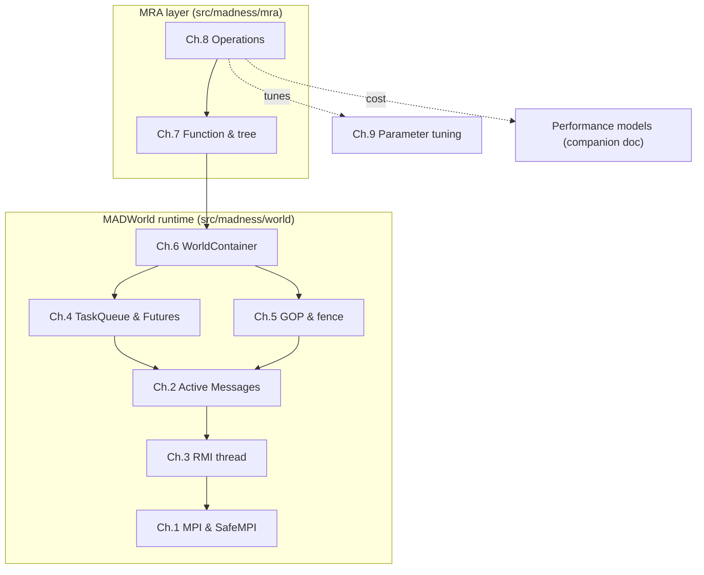

# MADNESS Parallel Runtime — Developer Guide

A from-the-source developer guide to the MADWorld distributed runtime and the
multiresolution function layer built on top of it. The goal is that, after
reading, you can reason precisely about *what happens on the wire and in the
thread pool* for any operation, and tune the runtime for a given workload.

Every chapter is grounded in `src/madness/world/` (runtime) and
`src/madness/mra/` (multiresolution). File:line citations are anchors into the
code at the time of writing — use them as starting points, not contracts.

Diagrams use [Mermaid](https://mermaid.js.org/) (rendered natively by GitHub) and
ASCII where a structural sketch is clearer.

---

## How to read this guide

The chapters build bottom-up. If you are new, read in order. If you came for a
specific operation or a tuning question, jump to chapters 8–9 and follow the
back-references.



---

## Table of contents

| # | Chapter | What it covers |
|---|---------|----------------|
| — | [Glossary & symbols](#glossary--symbols) | Notation used throughout |
| — | [Parameter quick reference](#parameter-quick-reference) | All runtime knobs in one table |
| 0 | [The big picture](#chapter-0-the-big-picture) | The layered stack and the five core ideas |
| 1 | [Communication layer: MPI & SafeMPI](01-communication-layer.md) | Process/thread model, the MPI mutex, tags |
| 2 | [Active Messages](02-active-messages.md) | `AmArg`, the send path, flow control |
| 3 | [The RMI thread](03-rmi-thread.md) | The communication server loop, ordering, huge messages |
| 4 | [Task queue & Futures](04-taskq-futures.md) | Dataflow tasks, dependencies, thread pool, remote tasks |
| 5 | [Global ops & `fence()`](05-gop-and-fence.md) | Binary-tree collectives, termination detection |
| 6 | [WorldContainer](06-worldcontainer.md) | The distributed hash map, pmaps, remote access |
| 7 | [Function representation & tree distribution](07-function-and-tree.md) | `Function`/`FunctionImpl`, `Key`, nodes, pmaps, load balancing |
| 8 | [Operations, piece by piece](08-operations.md) | compress, reconstruct, gaxpy, multiply, inner, apply, truncate |
| 9 | [Parameter tuning per operation](09-parameter-tuning.md) | What each knob does and how to set it per op |
| 10 | [Parallel function I/O & an HDF5 path](10-io-and-hdf5.md) | Archive system, parallel I/O bottlenecks, HDF5/MPI-IO analysis |
| — | [Performance models](../parallel_runtime_and_performance_models.md) | Quantitative time/comm/memory models (companion) |

---

## Glossary & symbols

| Symbol | Meaning |
|--------|---------|
| `P` | number of MPI ranks (processes) in a `World` |
| `d ≡ NDIM` | spatial dimensionality of a `Function` (1–6) |
| `k` | wavelet order — coefficients per dimension per box |
| `thresh` | truncation threshold ε |
| `L` | number of occupied tree levels (depth) |
| `N` | total number of tree nodes (global) |
| `N_leaf` | number of leaf nodes |
| `M` | number of separated terms in an operator kernel |
| `r` | low-rank (SVD) rank of a coefficient tensor, `r ≤ k^{d/2}` |
| `D_eff` | displacements surviving screening in `apply` |
| `α` | per-message latency |
| `β` | inverse bandwidth (sec/byte) |
| `R` | per-core flop rate |

**Vocabulary**

- **Rank / process / PE** — one MPI process. Each owns one `World` (per communicator).
- **World** — a wrapper around an MPI communicator + its four services.
- **Subworld** — a `World` over a sub-communicator (used by MacroTaskQ / state-parallel).
- **AM (active message)** — a one-way message that names a handler to run on the receiver.
- **RMI** — Remote Method Invocation; the dedicated communication thread + transport.
- **GOP** — Global OPerations; the collectives (`broadcast`, `reduce`, `fence`, …).
- **pmap** — process map; the function `Key → owner rank` that defines distribution.
- **Tree sweep** — an operation that walks the function tree, one task per node.
- **Fence** — global quiescence barrier; the operation boundary.

---

## Parameter quick reference

Runtime knobs (environment variables) and where they are read:

| Variable | Controls | Default | Min | Source |
|----------|----------|---------|-----|--------|
| `MAD_NUM_THREADS` | total application threads; **pool = N − 1** | #HW cores | — | `thread.cc:325-346` |
| `MAD_SEND_BUFFERS` | WorldAM managed send buffers (`nsend`) — caps in-flight AMs/rank | 128 (512 on CrayXT) | 32 | `worldam.cc:42-68` |
| `MAD_RECV_BUFFERS` | RMI posted receive buffers (`nrecv_`) | 128 | 32 | `worldrmi.cc:266-281` |
| `MAD_BUFFER_SIZE` | RMI receive buffer size (`max_msg_len_`); larger ⇒ fewer huge-msg rendezvous | 1.5 MB (`3·512·1024`) | 1024 | `worldrmi.cc:244-264` |
| `MAD_NSSEND` | every Nth send uses synchronous `Issend` (back-pressure) | = `nrecv_` | — | `worldrmi.cc:283-300` |
| `MAD_BACKOFF_US` | RMI `Testsome` poll backoff | 2 µs | 0 | `worldrmi.cc:383`, `:499` |
| `MAD_MAX_REDUCEBCAST_MSG_SIZE` | chunk size for `broadcast`/`reduce` | `INT_MAX` | — | `worldgop.h:633` |
| `MAD_BIND` | worker-thread CPU binding | platform | — | `world.cc:171` |

Build-time options (CMake):

| Option | Effect |
|--------|--------|
| `ENABLE_NEVER_SPIN` | waits sleep instead of spin — avoids livelock/oversubscription stalls in debug |
| `MADNESS_TASK_BACKEND` | `Pthreads` (default), `OneTBB`, or `PaRSEC` task engine |
| `MADNESS_DQ_USE_PREBUF` | thread-local task-submission prebuffers (lower lock contention) |
| `MADNESS_DQ_STATS` | collect `DQueue` push/pop/grow stats |
| `BUILD_SHARED_LIBS=OFF` | static libs (required for ASLR / reproducibility) |

Numerical knobs (`FunctionDefaults<NDIM>`, `funcdefaults.h`) — these drive both
accuracy and cost; see chapters 7–9:

| Knob | Meaning |
|------|---------|
| `k` | wavelet order; tensor size `k^d`; transform cost `∝ k^{d+1}` |
| `thresh` | truncation threshold; controls `N_leaf` |
| `initial_level` | starting refinement level for projection |
| `max_refine_level` | hard cap on tree depth |
| `special_level` | forced refinement near special points |
| `truncate_mode` | how `truncate_tol` scales with level |
| `autorefine` | refine during multiply to preserve accuracy |
| tensor type (`TT_FULL`, `TT_2D`, …) | full vs low-rank coefficient storage |
| pmap | `SimplePmap` / `LevelPmap` / `LBDeuxPmap` — the data distribution |

---

## Chapter 0: The big picture

MADNESS separates a **general distributed runtime** (MADWorld, in
`src/madness/world`) from the **numerical multiresolution layer**
(`src/madness/mra`). The runtime knows nothing about wavelets; the MRA layer is
"just" a sophisticated user of one runtime abstraction — the distributed
container.

```
        ┌─────────────────────────────────────────────────────────┐
  MRA   │ Function<T,NDIM>  (handle)  ──►  FunctionImpl<T,NDIM>     │  Ch.7
        │   adaptive 2^d-tree of Key ──► FunctionNode (k^d tensors) │
        │   operations = distributed tree sweeps                    │  Ch.8
        ├─────────────────────────────────────────────────────────┤
        │ WorldContainer<Key,FunctionNode> = distributed hash map   │  Ch.6
        │   pmap: Key ─► owner rank  (THIS is the data layout)      │
  WORLD ├──────────────────────────────┬──────────────────────────┤
        │ WorldTaskQueue + Future<T>    │  WorldGOP                 │  Ch.4 / Ch.5
        │ + DependencyInterface         │  collectives + fence      │
        │ (dataflow tasks)              │                           │
        ├──────────────────────────────┴──────────────────────────┤
        │ WorldAM  (active messages)                                │  Ch.2
        ├─────────────────────────────────────────────────────────┤
        │ RMI server thread  (owns the wire)                        │  Ch.3
        ├─────────────────────────────────────────────────────────┤
        │ SafeMPI  (thread-safe MPI wrapper)  +  WorldMpiInterface  │  Ch.1
        └─────────────────────────────────────────────────────────┘
```

**The five ideas that explain almost everything:**

1. **A `World` wraps an MPI communicator** and owns four services — `mpi`, `am`,
   `taskq`, `gop` (`world.h:204-207`). Subworlds are sub-communicators with their
   own `World`.
2. **Everything distributed is a `WorldContainer`** — a hash map whose keys are
   assigned to ranks by a *pmap*. A `Function`'s tree nodes live in such a
   container, so **the pmap literally is the data distribution.**
3. **Work is dataflow tasks.** A task holds a callable plus argument `Future`s and
   runs when all its inputs are ready. Tasks can run locally or be shipped to the
   rank that owns a key.
4. **One RMI thread per process owns the wire.** All point-to-point traffic is
   active messages funneled through this single thread; worker threads never call
   MPI for AM.
5. **`fence()` is global quiescence detection.** It returns only when every task is
   done and the global count of messages-sent equals messages-received.
   Operations are separated by fences.

Continue to [Chapter 1: Communication layer](01-communication-layer.md).
