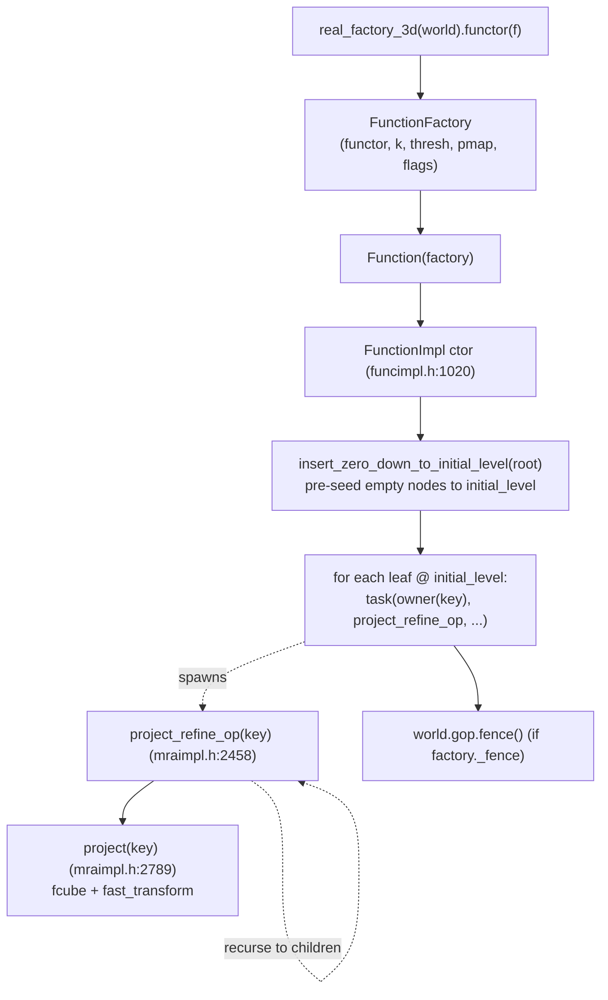
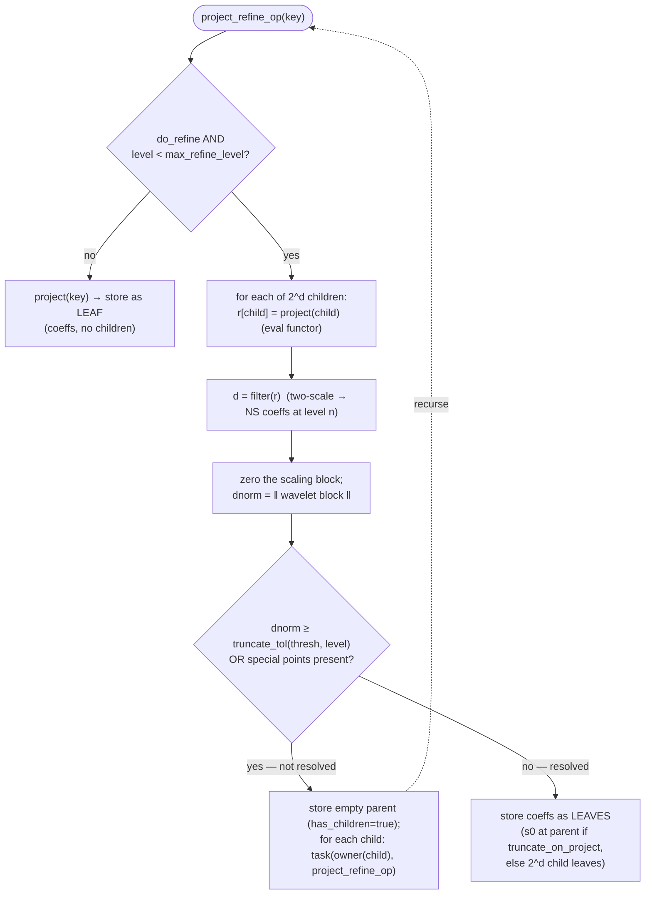

# Lesson 1 — Construction & Projection

How a `Function` is born: projecting a user functor `f(r)` onto the
multiresolution scaling-function basis, building the adaptive tree **top-down**
as the runtime discovers where refinement is needed.

Source path (top → bottom of the layering):
`mra.h` `FunctionFactory` / `Function(factory)`
→ `funcimpl.h:1020` `FunctionImpl(factory)` ctor
→ `mraimpl.h:2458` `project_refine_op` (the recursion)
→ `mraimpl.h:2789` `project(key)` (the per-box numerical kernel).

---

## 1. What "projection" means

Given a black-box function `f(r)` (a `FunctionFunctorInterface`), we want its
adaptive MRA representation: a tree of boxes where each **leaf** stores the `k^d`
scaling-function coefficients that represent `f` to accuracy `thresh` inside that
box. The tree is *adaptive* — it refines only where `f` has structure. The whole
job is "decide the tree shape and fill the leaves," and it is done top-down.

---

## 2. The call chain



The ctor (`funcimpl.h:1037-1061`) seeds empty nodes down to `initial_level`, then
**spawns one `project_refine_op` task per seed leaf on that key's owner**, and
fences once. Refinement proceeds from there.

---

## 3. The per-box recursion (the heart)

`project_refine_op(key, do_refine, specialpts)` (`mraimpl.h:2458-2533`) decides,
for one box, whether the box is "resolved" or must refine — by looking **one level
ahead** at its children:



The adaptive criterion: build the `2^d` children's scaling coefficients, run the
two-scale `filter` to split them into a parent **scaling** block + a **wavelet
(detail)** block, and measure the detail norm `dnorm`. Small detail ⇒ order-`k`
polynomials already capture `f` here ⇒ stop (store a leaf). Large detail ⇒ refine
(the children become the new frontier and each gets its own task).

`truncate_tol` (`mraimpl.h:649`) sets the per-box threshold; with the common
`truncate_mode=1` it is `thresh · min(1, 0.5^level · L)` — the bar tightens with
depth so total accuracy holds.

`special_points` (e.g. nuclei / orbital cusps) force refinement down to
`special_level` regardless of `dnorm`.

---

## 4. `project(key)` — the per-box numerical kernel

```
project(key)   (mraimpl.h:2789)
  ├─ fcube:           evaluate f at the k^d Gauss-Legendre quadrature points
  │                   → k^d functor calls            (the only place f is sampled)
  ├─ scale:           × sqrt(cell_vol · 0.5^{d·level})
  └─ fast_transform(work, quad_phiw):
                      values(k^d)  --(k×k matrix per axis)-->  scaling coeffs(k^d)
                      separable transform, cost ~ d · k^{d+1}
```

So one box costs `k^d` functor evaluations plus a `Θ(d·k^{d+1})` transform. The
refinement test at a box runs `project` on its `2^d` children plus one `filter`
(another `Θ(d·k^{d+1})`).

---

## 5. How it runs in the parallel runtime

This is the distinctive part: **the tree does not exist yet**, so unlike every
later operation (which traverses an existing distributed tree), construction
*creates* the distribution as it discovers boxes.

```
 top-down task spawn (one task per box, placed by the pmap):

   root .................. owner(root)        project_refine_op
   ├─ 00 ................. owner(00)  = rankB   refine → spawns children
   │   ├─ 000 ............ owner(000) = rankA   leaf (resolved)
   │   └─ 001 ............ owner(001) = rankC   refine → spawns children → ...
   ├─ 01 ................. owner(01)  = rankC   leaf
   └─ ... (2^d children)

   placement = coeffs.owner(child)        [normal pmap], OR
             = world.random_proc()        [if project_randomize]
   one global fence after the frontier drains.
```

Runtime mapping (ties to the guide chapters):

- **One task per box**, sent via `woT::task(owner(child), &project_refine_op, …)`
  (`mraimpl.h:2512`) — a remote task to the child key's owner (Chapter 4/6).
- **Distribution as you go.** Because the tree shape is unknown a priori,
  `project_randomize` (`mraimpl.h:2505`) can place children on *random* ranks to
  balance load during construction — the opposite of the locality-seeking pmaps
  used later. Trade-off: good build-time balance, poor parent/child locality (but
  construction has no parent↔child data dependence *downward*, so that's fine).
- **No downward data dependency.** A child's `project_refine_op` only needs its
  own key + the shared functor (replicated) — not the parent's coefficients. So
  the whole frontier runs as embarrassingly parallel tasks; the recursion fans out
  with no cross-task communication except task dispatch.
- **One fence** closes the operation (`funcimpl.h:1061`), after which the tree is
  complete and quiescent.

---

## 6. Cost & how `N_leaf` emerges

| Quantity | Per box | Whole function |
|----------|---------|----------------|
| functor evals | `2^d · k^d` (children) | `N_internal · 2^d · k^d` |
| transform flops | `Θ(d·k^{d+1})` (children) + filter | `Θ(N · d·k^{d+1})` |
| tasks | 1 (+ up to `2^d` spawned) | `Θ(N)` |
| communication | task dispatch only | `Θ(N)` small AMs, **no coefficient traffic**, 1 fence |

`N_leaf` is *emergent*, not chosen: the recursion stops where `dnorm <
truncate_tol`, so smooth regions stay coarse and structured regions (near
`special_points`, cusps, oscillations) refine deep. This is why `N_leaf` depends
on `(thresh, k)` and the function's smoothness, with no closed form (guide §7.5).

---

## 7. mra vs vmra for construction

Constructing a `std::vector<Function>` of `n` functions = `n` **independent**
top-down recursions (different functors, disjoint trees). There is no
cross-function coupling, so the only batching win is **one fence for the whole
vector instead of `n`** — but the concurrency win is large: all `n` recursions'
frontiers are in the task queue at once, saturating workers. This is why building
many orbitals scales well on compute and is bounded only by resident memory
(the `n_occ · N_leaf · k³ · 8` term).

---

## Key takeaways

1. Construction is **top-down and adaptive**; it *builds* the distributed tree.
2. The refine/stop decision is **look-ahead**: project the `2^d` children, filter,
   test the wavelet (detail) norm against a level-scaled tolerance.
3. `project(key)` is the only place the functor is sampled (`fcube`, `k^d` points)
   and is followed by a separable `Θ(d·k^{d+1})` transform.
4. In the runtime it is **one task per box**, placed by the pmap (or randomized),
   with **no coefficient communication** and **one closing fence** — the cheapest-
   communication heavy operation, unlike `apply`.
5. Building a vector batches the fence and floods the queue with independent work.

Next lesson: **representation changes** — `change_tree_state` / `compress` /
`reconstruct`, where (unlike construction) parent and child *are* coupled and the
sweep direction and cross-rank edges start to matter.
